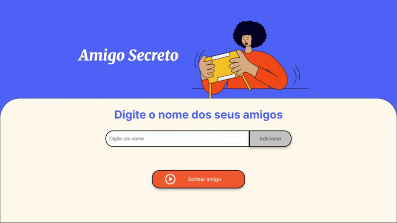
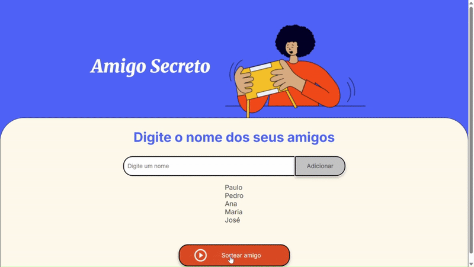

# Amigo Secreto

Este projeto é um aplicativo web simples para organizar sorteios de amigo secreto. Os usuários podem adicionar nomes de amigos e realizar o sorteio para descobrir quem tirou quem.

## Funcionalidades

* Adicionar nomes de amigos: Os usuários podem inserir nomes na lista de participantes.
* Realizar sorteio: O aplicativo realiza o sorteio e exibe os pares de amigos sorteados.
* Interface amigável: A interface é intuitiva e fácil de usar.

## Demonstração

### Adicionando Nomes

### Realizando o Sorteio

## Como Usar

1.  Acesse o aplicativo web através do [link do Vercel](https://challenge-amigo-secreto-khaki-ten.vercel.app/).
2.  Digite os nomes dos amigos no campo de entrada e clique em "Adicionar".
3.  Clique em "Sortear amigo" para realizar o sorteio.
4.  Os resultados do sorteio serão exibidos na lista de resultados.

## Estrutura do Projeto

* `index.html`: Estrutura HTML da página.
* `app.js`: Lógica JavaScript do aplicativo.
* `style.css`: Estilos CSS da página.
* `assets/`: Pasta contendo imagens e outros recursos.
* `adicionandoNomes-ezgif.com-video-to-gif-converter.gif`: GIF demonstrando a adição de nomes.
* `sorteandoNomes-ezgif.com-video-to-gif-converter.gif`: GIF demonstrando o sorteio.
* `LICENSE`: Arquivo contendo a licença MIT.

## Tecnologias Utilizadas

* HTML
* CSS
* JavaScript

## Licença

Este projeto está licenciado sob a [Licença MIT](LICENSE).

## Imagens

* `assets/amigo-secreto.png`: Imagem representativa do amigo secreto.
* `assets/play_circle_outline.png`: Ícone para sortear.

## Observações

* Certifique-se de que os arquivos de imagem e GIF estejam na pasta raiz do seu repositório ou em uma pasta `assets/`.
* O arquivo `LICENSE` deve conter a licença do seu projeto.
* O arquivo `style.css` é responsável pela estilização da página.
* O arquivo `app.js` contém a lógica principal do aplicativo.
* O arquivo `index.html` é a estrutura HTML da página.
* O arquivo `README.md` é um arquivo de documentação que descreve o projeto.
